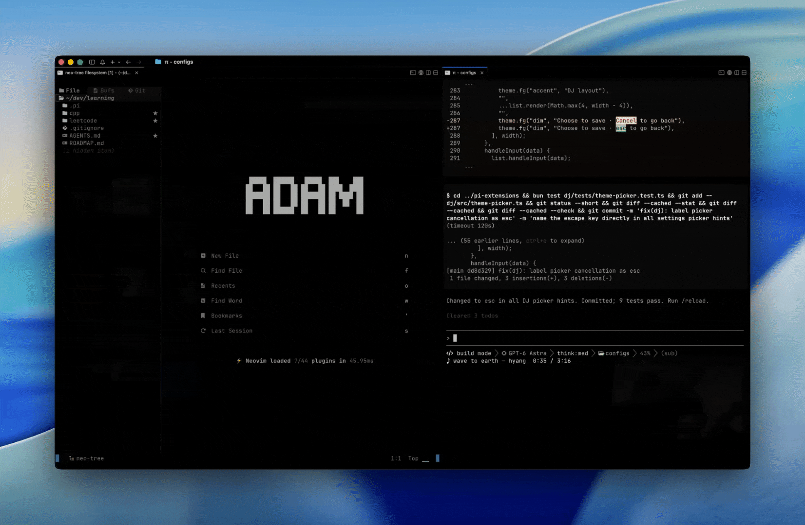
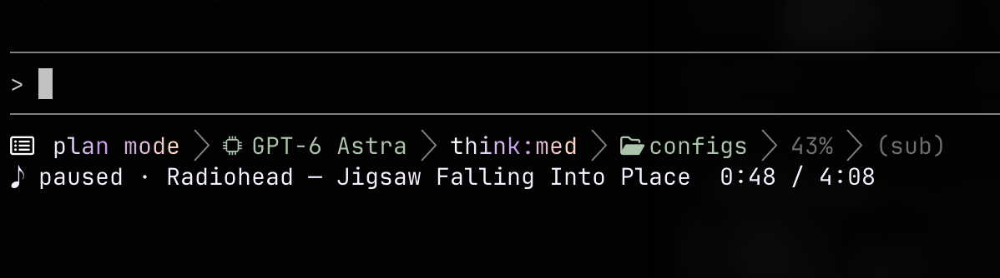
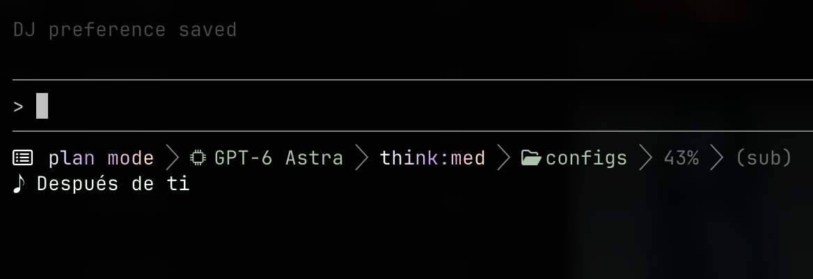
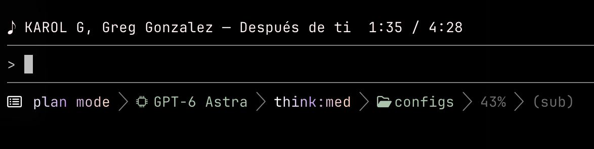

# dj

Spotify now playing for [Pi](https://github.com/earendil-works/pi), with pastel colors and live previews.


*Spotify while you work.*

- `/dj`: toggle
- `/dj layout`: minimal, medium, full
- `/dj theme`: animated palettes, solid colors, custom hex
- `/dj placement above|below`: move around the editor
- `/dj auth`: connect Spotify

<table>
  <tr>
    <td colspan="2"><br/><em>Full layout, paused.</em></td>
  </tr>
  <tr>
    <td><br/><em>Minimal: title only.</em></td>
    <td><br/><em>Above the editor.</em></td>
  </tr>
</table>

## Install

```sh
git clone https://github.com/0xABAN/pi-extensions.git
cd pi-extensions && bun install --ignore-scripts
pi install ./dj
```

Run `/reload`, then `/dj auth`. First connection needs a [Spotify app and redirect URI](REFERENCE.md#spotify-setup).

[Reference](REFERENCE.md) · Based on [Agent DJ](https://github.com/AdamPSU/agent-dj) · [Apache-2.0](LICENSE)
